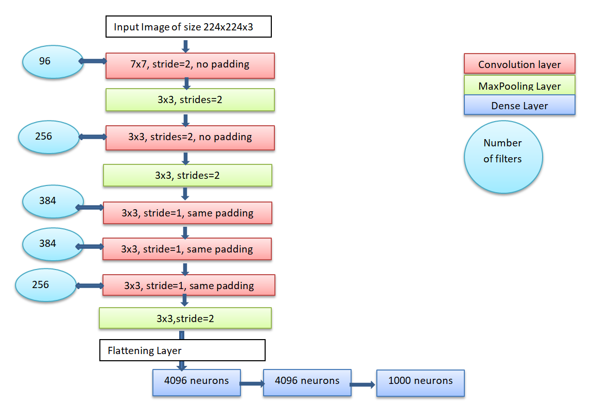

# ZFNet architecture from scratch

## About architecture

It is imperative to know about AlexNet before coming to ZFNet. AlexNet was primarily designed by Alex Krishevsky. It was published with Ilya Sutskever and Geoffry Hinton.It won first place in ImageNet large Scale Visual recognition Challenge in 2012 by achieving error of 15.3%.This was 10.8% lower than that of runner up. AlexNet was considered as a massive jump in the accuracy of neural networks.

Rob Fergus and Matthew D.Zeiler introduced ZFNet. ZFNet is named after their surname Zeiler and Fergus. ZFNet was a slight improvement over AlexNet .The 2013 ILSVRC was won by ZFNet.It actually visualized how each layer of AlexNet performs and what parameters can be tuned to achieve greater accuracy.

## Architecture Components

### Convolutional Layers
- In these layers convolutional filters are applied to extract important features,ZFNet consists of multiple convolutional layers to extract important features.

### Max Pooling Layers
- MaxPooling Layers are used to downsample the spatial dimensions of feature map in.It consist of aggregation function known as maxima.

### Deconvolution Layers 
- ZFNet introduced a visualization technique involving deconvolutional layers(Transposed Layers) .These layers provide insights into what network has learned by projecting feature activations back into input pixel space.

### Fully Connected Layers
- In the latter part of ZFNet architecture fully connected dense layers are used to extract patterns from features .The activation function used in the neurons is relu.